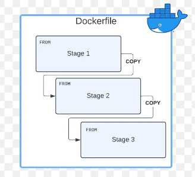
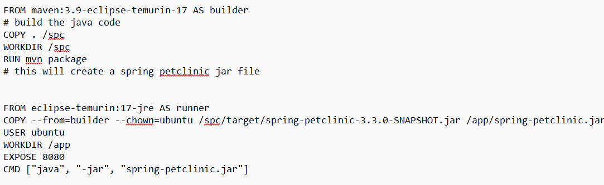
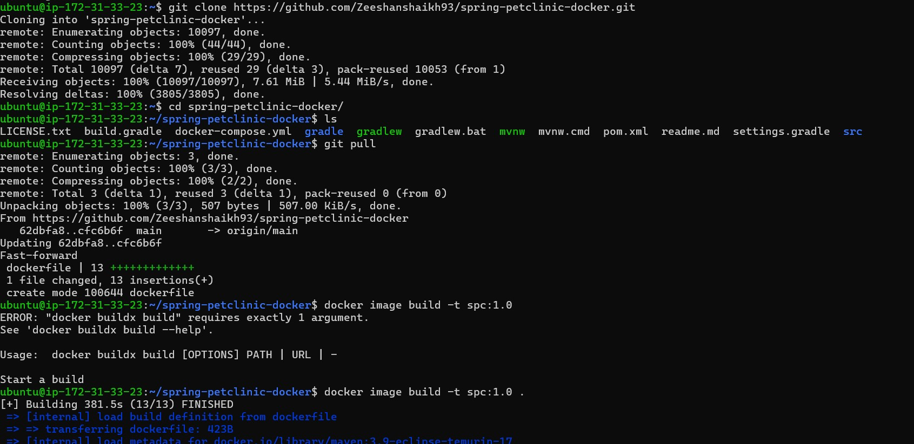
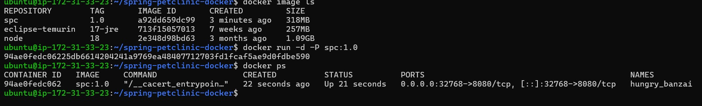
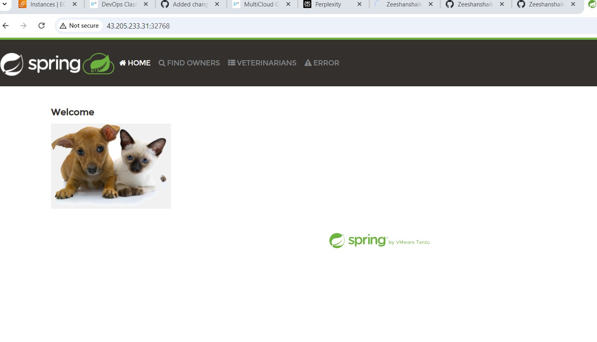

# Running a spring-pet clinic in docker

## Multi stage Docker files

* First we have to clone the spring-pet clinic repo in to our local system
* Then create a "dockerfile" in the spc repo and add the *FROM* statements 
* *Note* : while creating a Multiple stages the last stage is considered as a runner in the application in DOCKERFILE.
 

* Take the spring-pet clinic from github and make it *fork* & manually clone into the current folder in which execution is done.
* Then, in spring pet clinic make a new file called "dockerfile"
* In dockerfile we have to write the FROM statements for running the docker file commands
* *EXAMPLE*

* Then we have to execute the following commands,

* Run this in the terminal using following commands,

* make sure that add "." it reprents to building the docker image
* it builds the image
* For enabling the port number following commands are to be followed,

* At last by enabling the given port number, SPC executed.

## Docker Commands for pulling image & Pushing it into Docker hub

docker pull nginx:1.27

docker build -t img:1.0

docker image ls

docker container run -d -P --name myserver img:1.0

docker ps

## Pushing dockerfile into dockerhub

docker login

docker login -u zeeshanshaikh93

password: zeeshan799351$

successfully login

upload your dockerfile using "vi <Filename>"

docker image tag img:1.0 zeeshanshaikh93/<new-tag-name>

docker push zeeshanshaikh93/<new-tag-name>

successfully mounted to dockerhub.