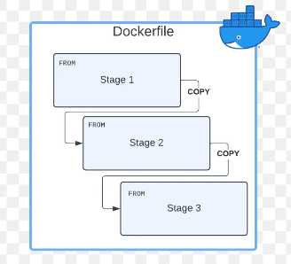
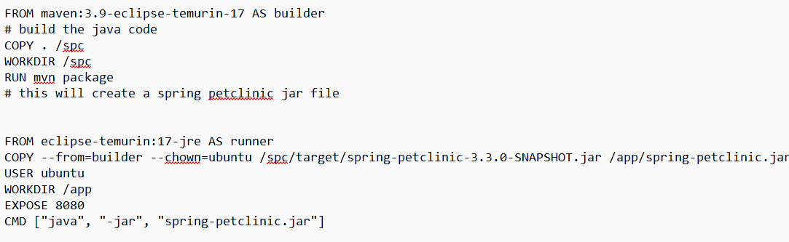
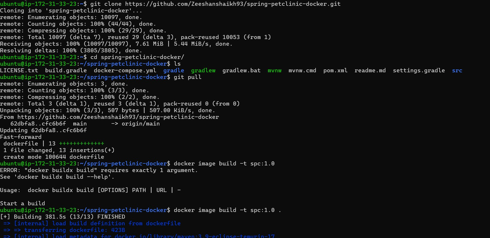
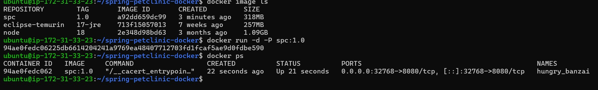
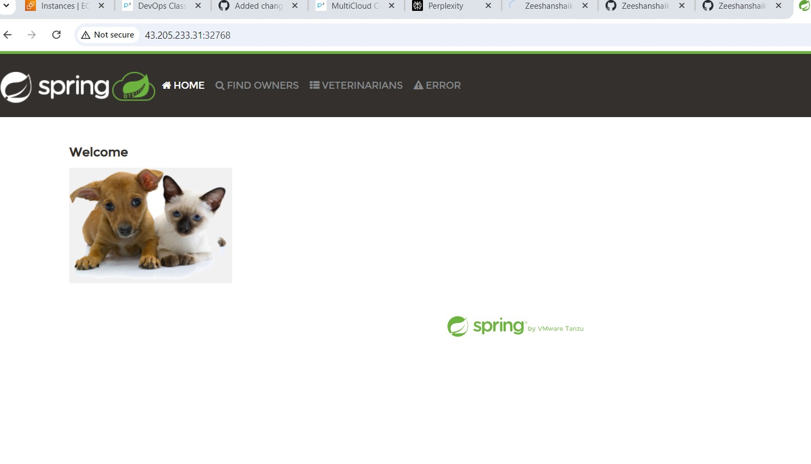

# Running a spring-pet clinic in docker

## Multi stage Docker files

* First we have to clone the spring-pet clinic repo in to our local system
* Then create a "dockerfile" in the spc repo and add the *FROM* statements 
* *Note* : while creating a Multiple stages the last stage is considered as a runner in the application in DOCKERFILE.
 

* Take the spring-pet clinic from github and make it *fork* & manually clone into the current folder in which execution is done.
* Then, in spring pet clinic make a new file called "dockerfile"
* In dockerfile we have to write the FROM statements for running the docker file commands
*  *EXAMPLE*
* Then we have to execute the following commands, 
  

* Run this in the terminal using following commands,
* 

* make sure that add "." it reprents to building the docker image 
* it builds the image
* For enabling the port number following commands are to be followed,

 

* At last by enabling the given port number, SPC executed.

